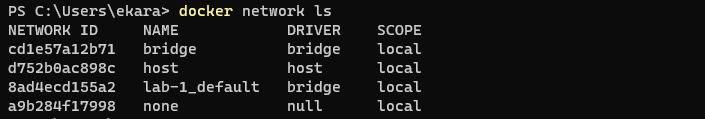

# Welcome to the AIOps Lab 1

> Screen shots taken and upload as part of my GitHub repo:

#### a. Our Application page

    Displaying the running Docker images

    Running Web with Items

#### b. Updating our App page
    Modified titles

    Modified titles with items

#### c. Sharing our App page
 Docker desktop images
 
    Uploaded image to the docker hub

#### d. Persisting our DB page
 Creating a volume
 
  Use Volume

 Persisted data
 
 Volume Page

#### e. Using Bind Mounts page
 Run nodemon
 
#### f. Using Docker Compose page
 Docker compose file
 
  Running docker compose
    docker compose up

    Docker compose ls

#### g. Custom network page
 containers running on my custom network
 
 Network inspection
 
 

#### h. Remote in to running container page
 Terminal Session
 
 