# Lab 3 Anomaly Detection

## Lab Task – Building the Prophet model
1. Revisit the app_one Python code
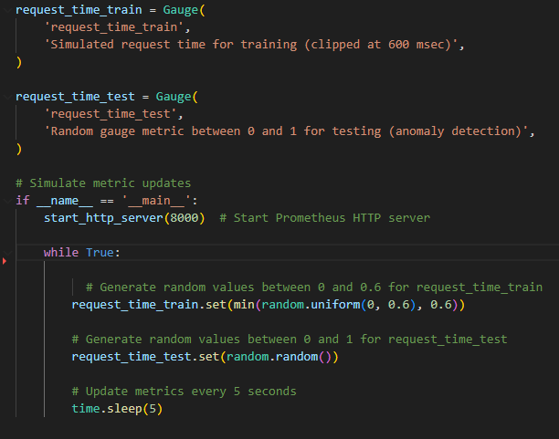

2. Prometheus Metrics
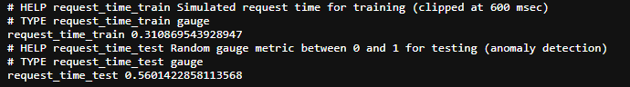

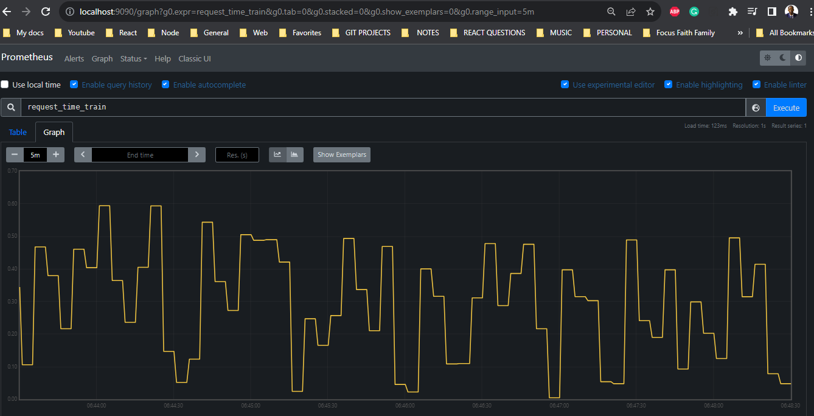
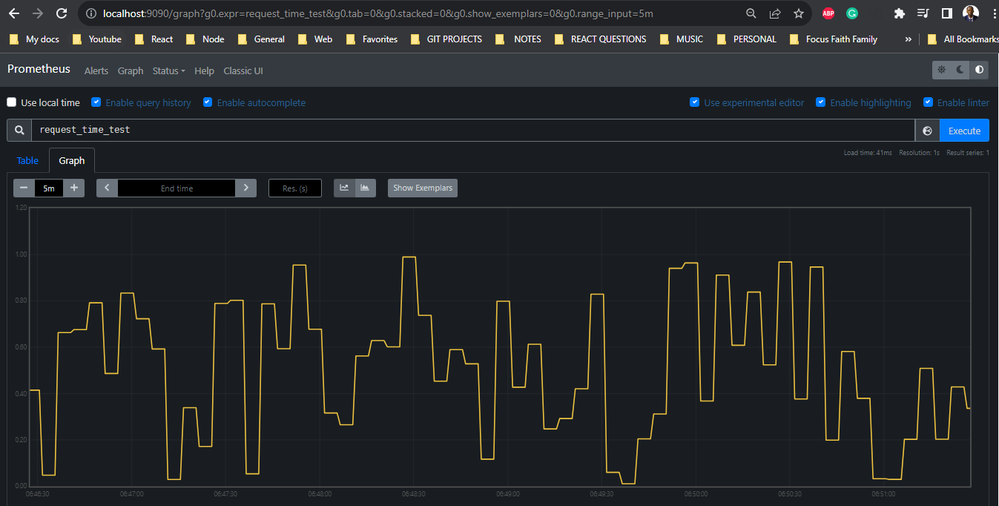

3. Two metrics in Grafana dashboard
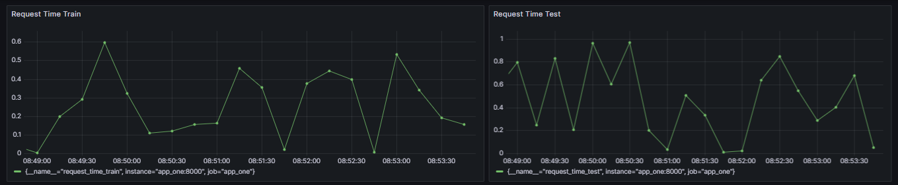

4. Anomalies detected to the console log
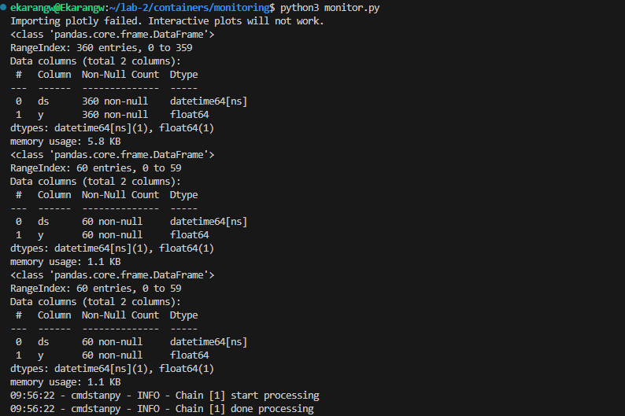
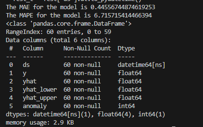

## Lab Task – Package model as Docker container/image
        Docker container update
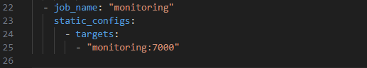

        Model quality metrics
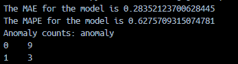
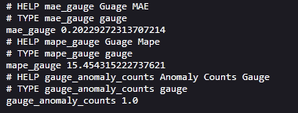

        Anomaly counts, MAE and MAPE
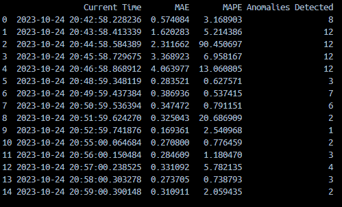

- Grafana Dashboards
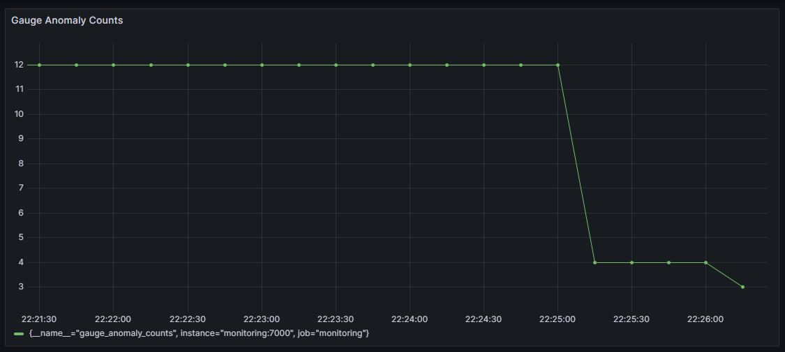
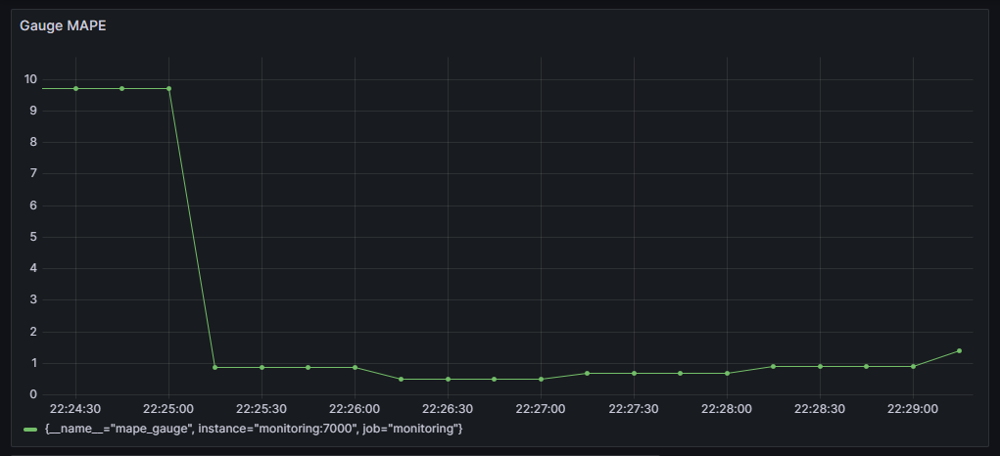
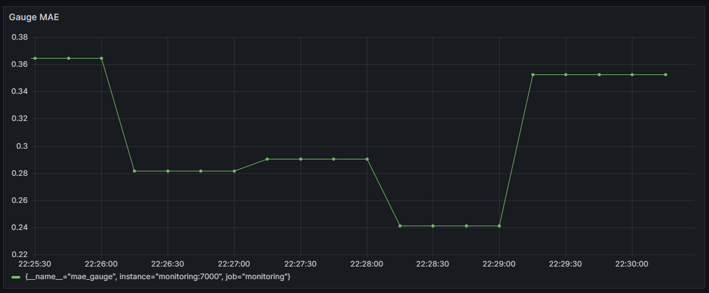

## Lab Task – Explore model quality vs training time series and forecast durations
        weekly_seasonality
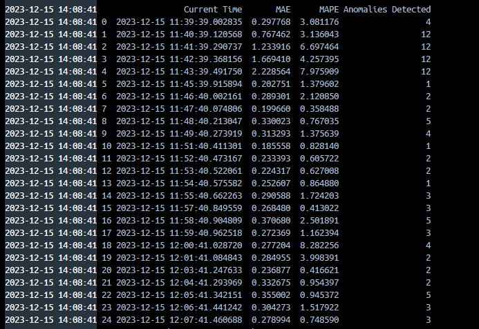

        daily_seasonality
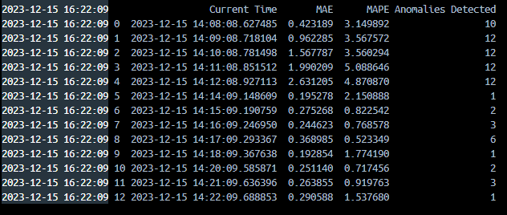

### 1. Seasonality in the Model:
 It appears that enabling weekly seasonality (while disabling yearly and daily seasonality) has been helpful in capturing patterns in the data. This is evident from the "Anomalies Detected" column, which shows the occurrences of anomalies in the data. The fact that the number of anomalies detected remains relatively consistent suggests that the model is effectively capturing and accounting for variations in the data. Additionally, the "MAE" (Mean Absolute Error) and "MAPE" (Mean Absolute Percentage Error) values are within reasonable ranges, indicating that the model's forecasts are reasonably accurate.

### 2. Forecast Horizon and Training Data:
- From the monitoring file, indicates that the forecast is in interval of 1 minute. The forecasting horizon is limited to short-term predictions within a few minutes. Adding a longer baseline of training data can potentially improve the model's ability to make longer-term forecasts by capturing longer-term trends and patterns. 

### 3. Reasonable Baseline of Data for Production:
- The choice of a reasonable baseline of data for a Prophet model in a production system depends on several factors, including the nature of the metric data, the desired forecasting horizon, and the acceptable trade-off between responsiveness and accuracy.
- A longer baseline of data (historical data) is generally helpful for understanding long-term trends and improving forecast accuracy. However, the ideal baseline depends on the specific use case.
- Operational challenges might arise if the length of training data becomes too large. Longer training times may require more computational resources and storage space.

### 4. Retraining in a Production Setting:
- Whether a Prophet model should be allowed to retrain continuously in a production setting or require manual review/approval depends on the specific use case and the importance of real-time responsiveness.
- Advantages of Continuous Retraining:
        1. `Real-time adaptability:` Continuous retraining allows the model to adapt quickly to changing data patterns.
        2. `Improved accuracy:` It helps in capturing short-term fluctuations and anomalies.
- Pitfalls of Fully Automatic Operation:
        3. `Overfitting:` If not carefully managed, continuous retraining may lead to overfitting, especially if there are data quality issues or noise.

