## Lab 4

#### Lab Task 1 – Basic Kubernetes operations
- Creating a cluster called Lab 4
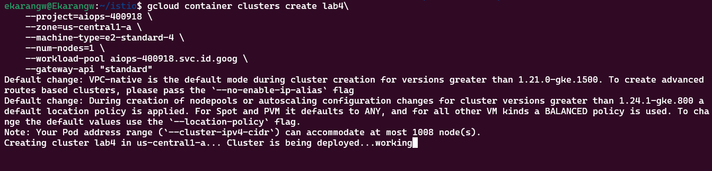

- Istio
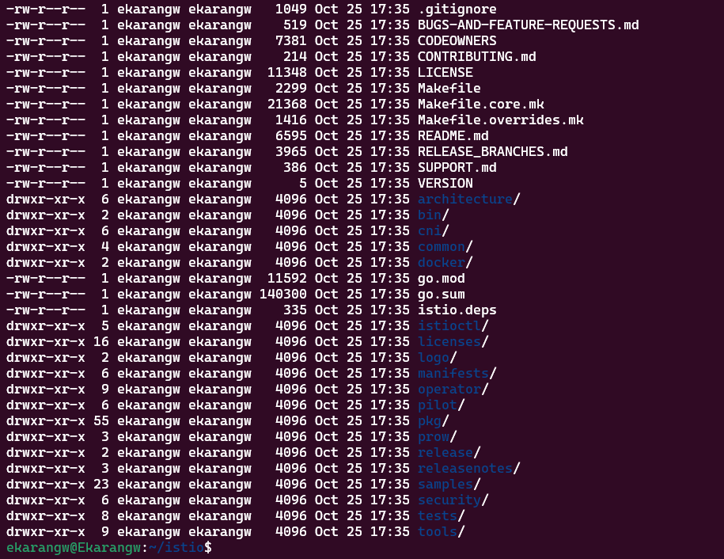

- Deploy application using kubectl
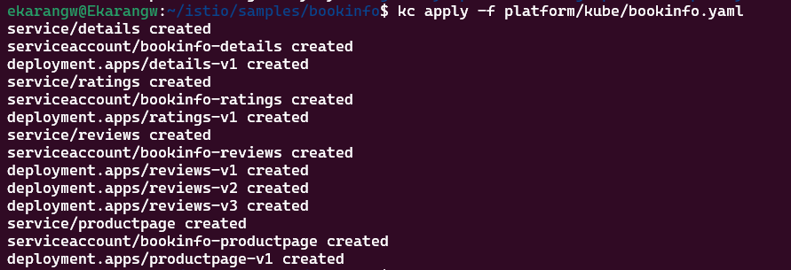

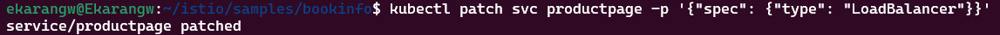

- Running Services
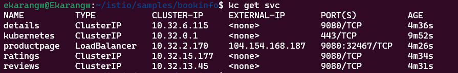

- Running Producut page using external Ip
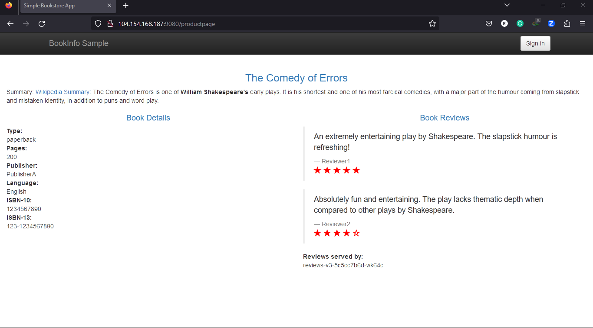

- Get Deployments
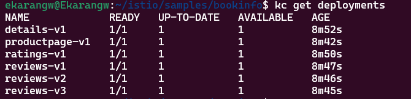

- Get Pods
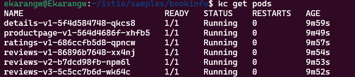

- Product Page pod logs
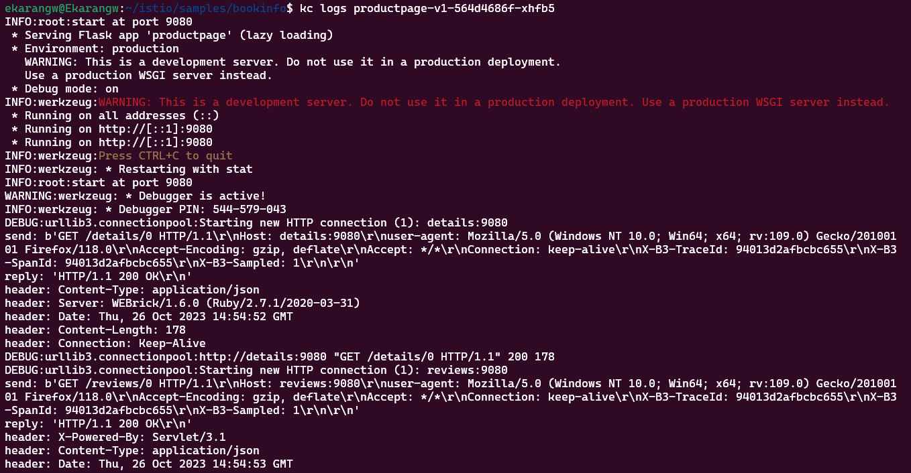

- Resourse describe
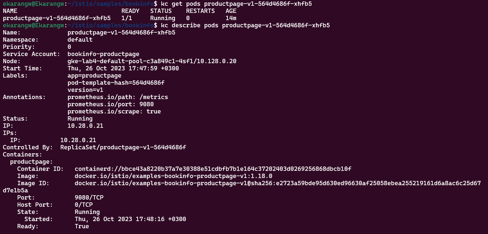

- Ratings descrip pod
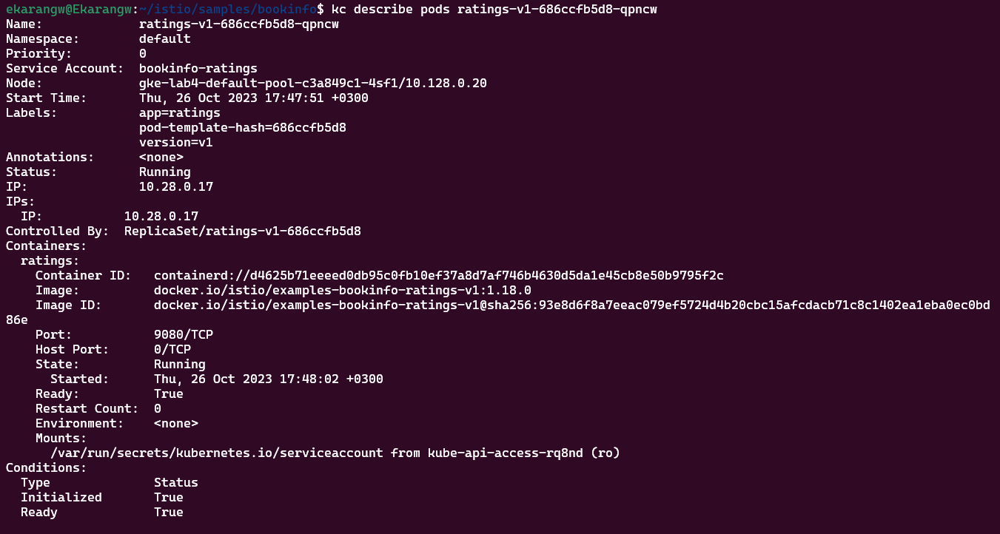

- Scalling ratings
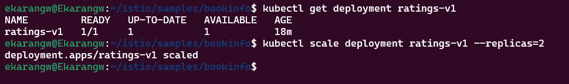

- Verify scalling
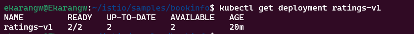

- Verify running port on 9080
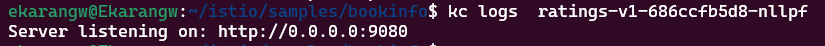

- Scalling back 
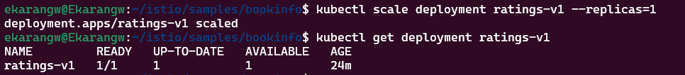

#### Lab Task 2 – Build and deploy a new image to GKE
- Building the image
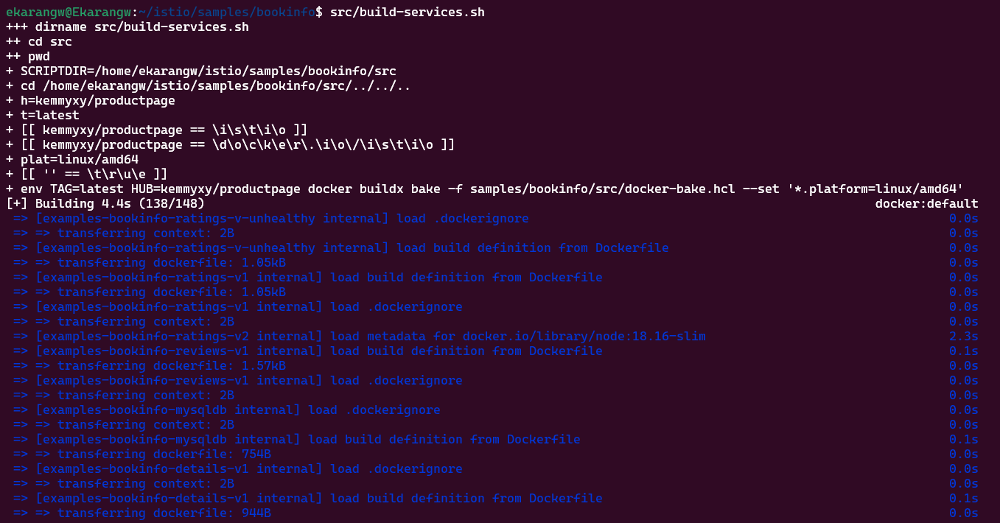

- Images
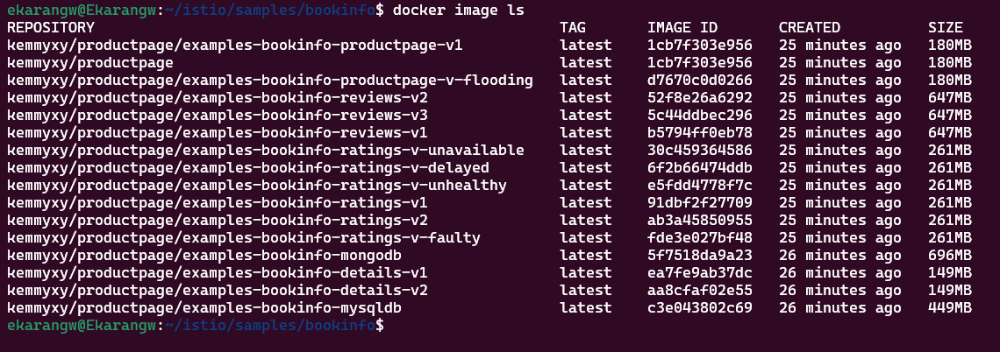

- Dockerhub image
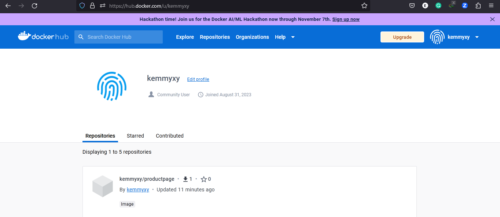

- Docker images ls
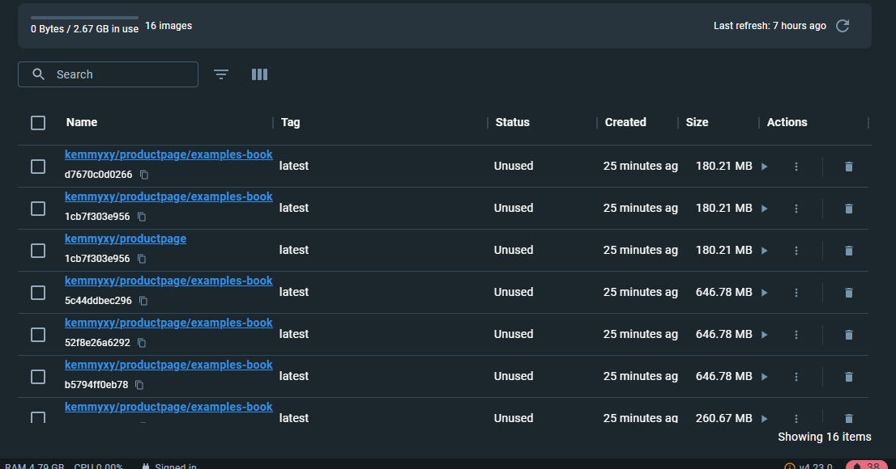

- Redeployed web page
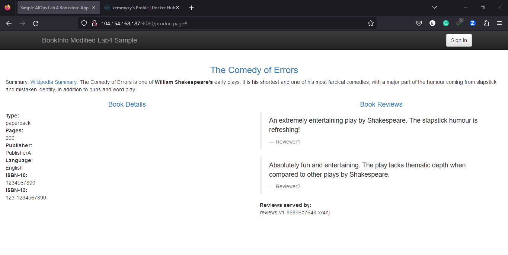

- Verify new deployment
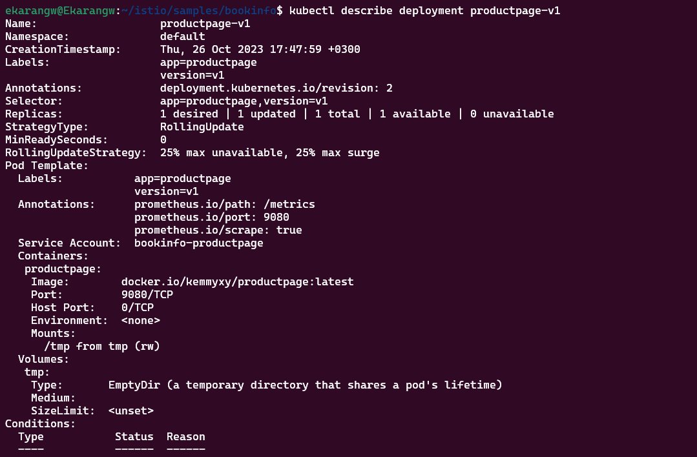

#### Lab Task 3 – Monitor GKE with Prometheus/Grafana
- Update the Prometheus
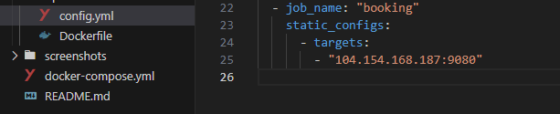
- Grafana dashboard for the bookinfo
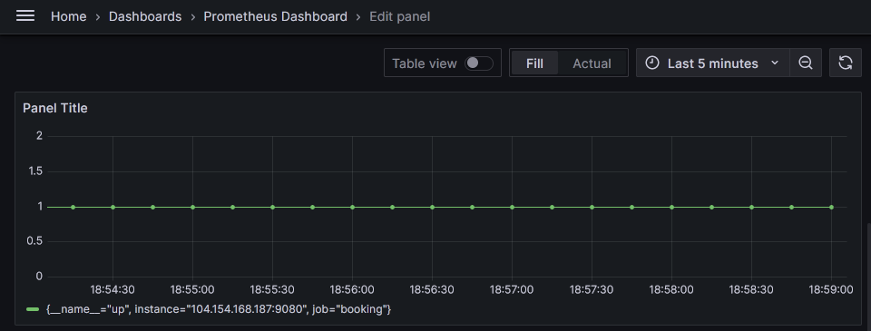