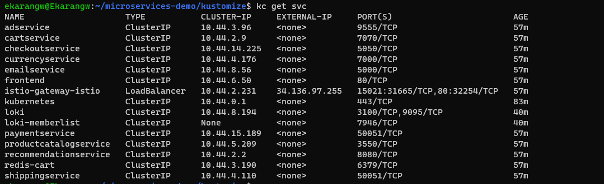
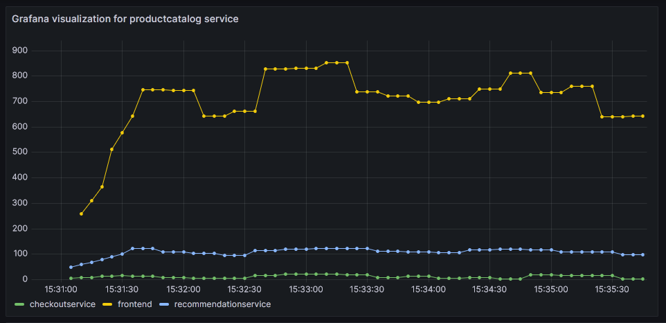

## Lab 5: Capturing application metrics with Istio service mesh

#### Lab Task 1 – Install and configure the Boutique application

#### Lab Task 2
- 1 Install the addons

- 2 Start the Prometheus, Kiali and Grafana dashboards

- Create a simple Prometheus query
    productcatalogservice query

#####  Grafana dashboard

## 7

### 8

### 9

## Lab Task 3 (From Kiali exploration)

- addservice

- cartservice

## Lab Task 4
- Deploying Delay 0.2 seconds

- Deploying Delay 0.4 seconds

- screen shot from Kiali showing shipping service response times to the Source.

### Shut down the cluster
    kubectl delete -k .

    kubectl delete -f /sample/addons

- Delete cluster
    gcloud container clusters delete lab5    --project=aiops-400918     --zone=us-central1-a

