# Lab 6: Anomaly detection in GKE with Prophet and Istio

### Lab Task 2 – Train a Prophet model with seasonality for normal operation
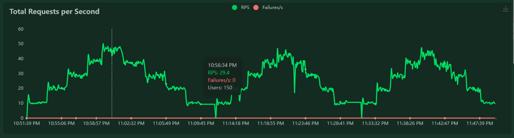
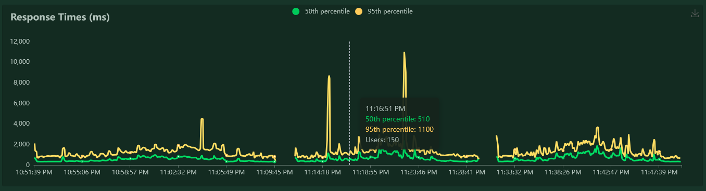
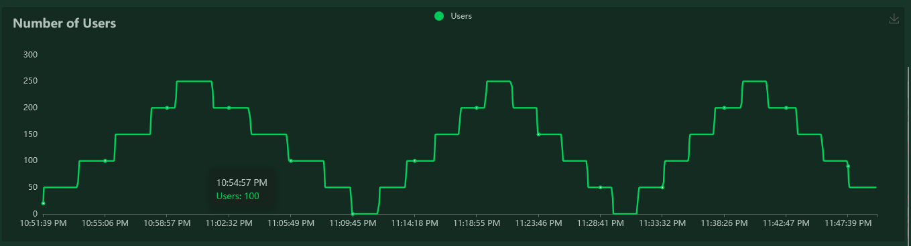

- Scrap data
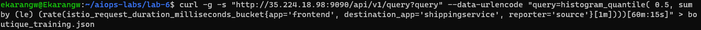
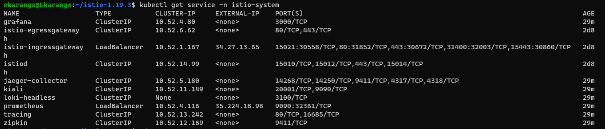

2. Set the Load environment variables
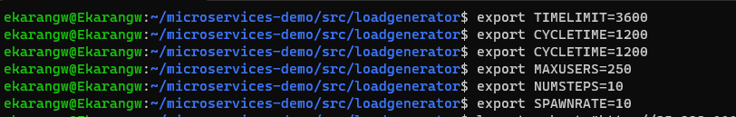

3. Generate  training data from Prometheus
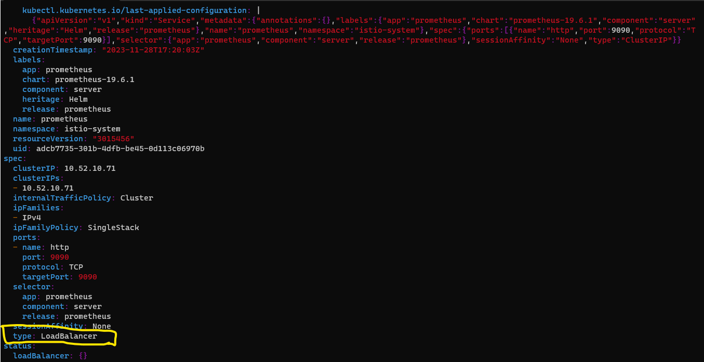
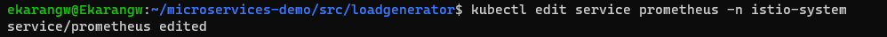

5. Save the training data pulled by the curl command to a local file
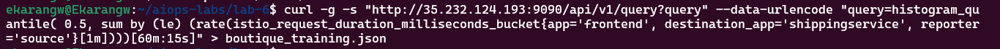

6. Training Metric
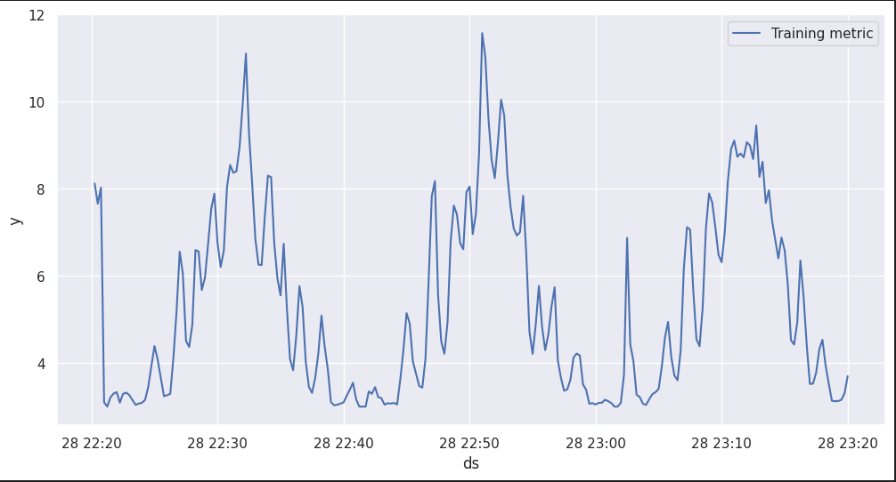

- Forecast
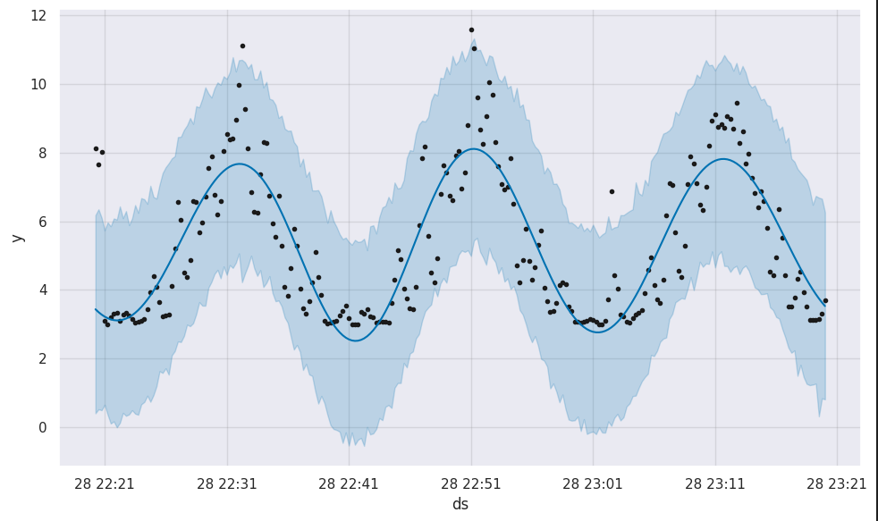

### Lab Task 3 – Verify no/minimal anomaly detection under normal operation
- Trend and Hourly
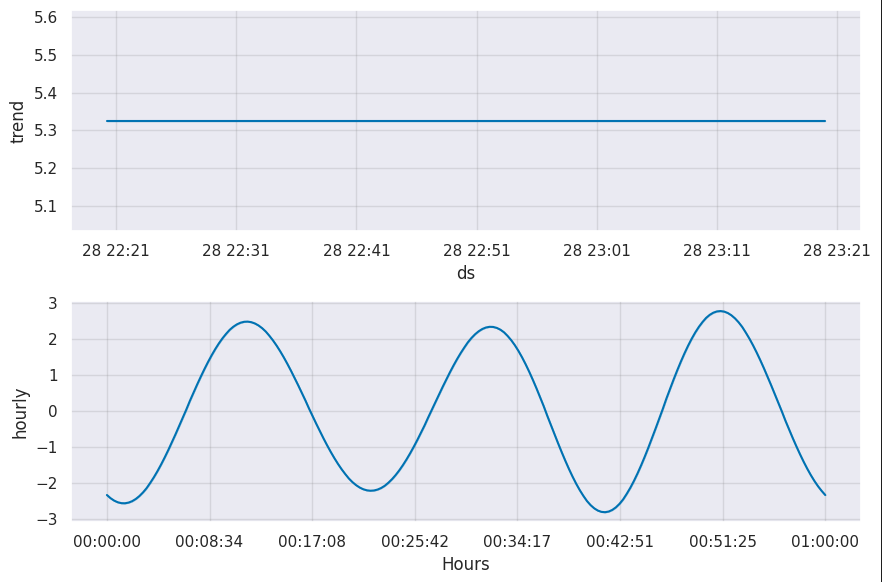

- Run monitor file
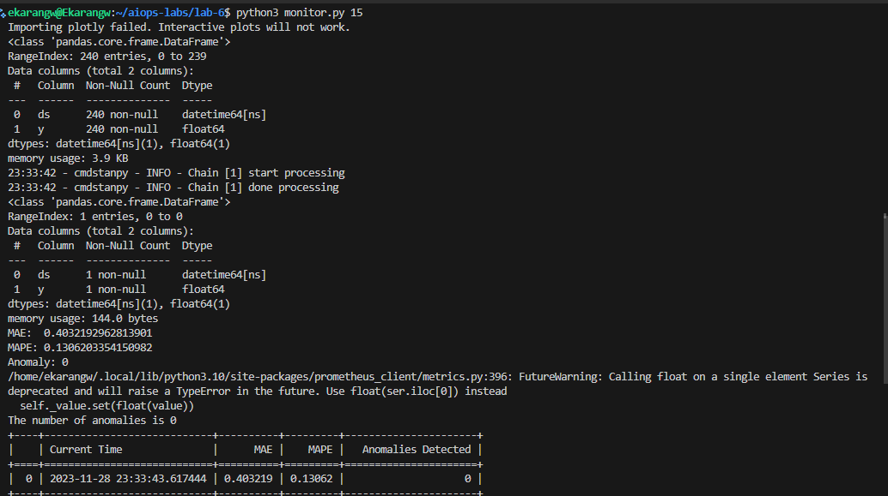

2. read input argument
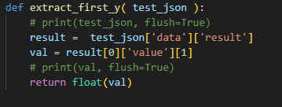

3. code should contain just one loop following the initial model training
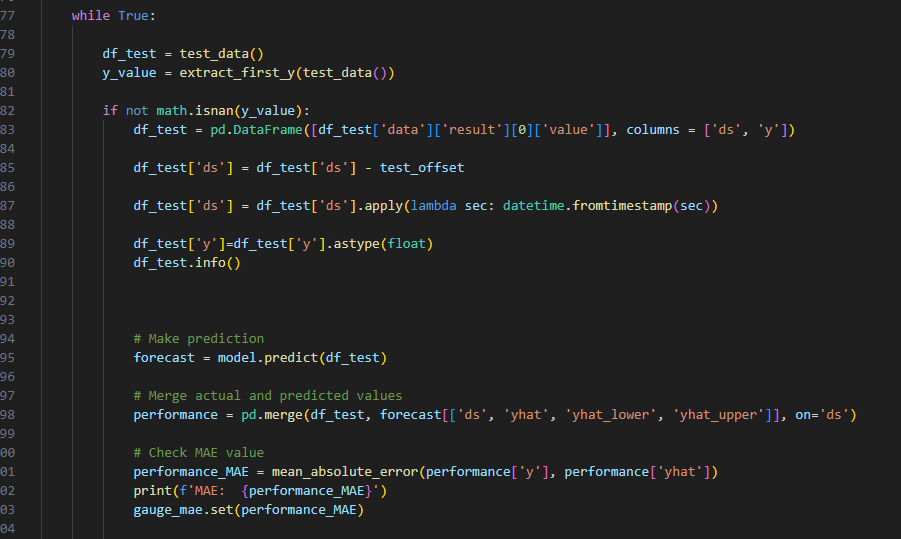

 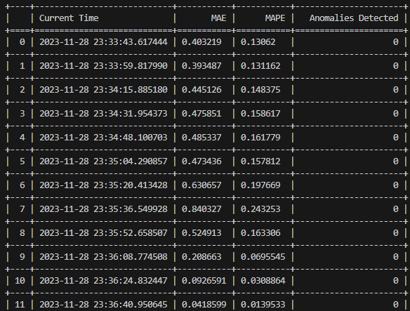

### Lab Task 4 – Inject faults with Istio to detect anomalies
1. 

### Lab Task 5 – Deploy your monitor into the Boutique cluster and publish to Grafana
1. 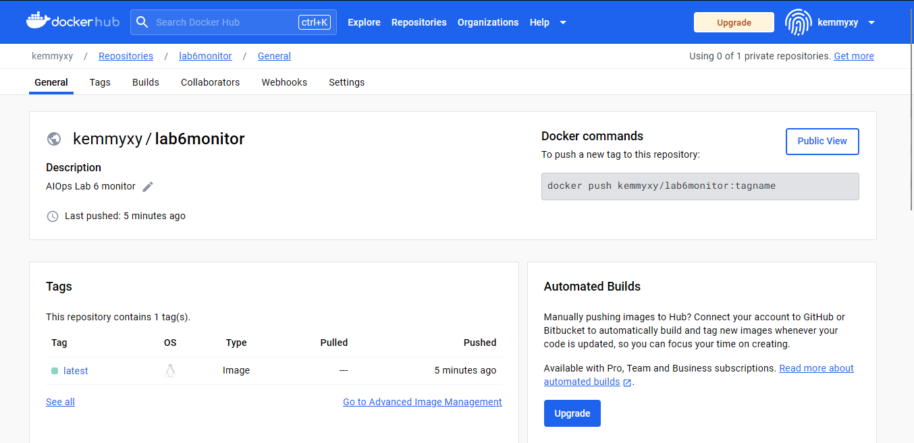
2. 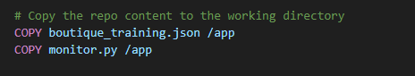
3. 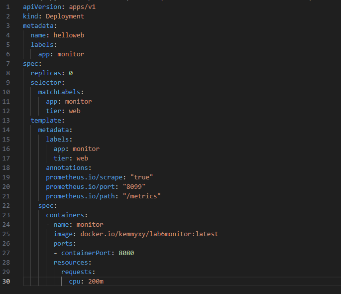
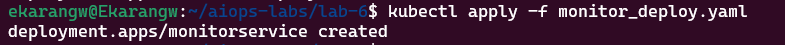
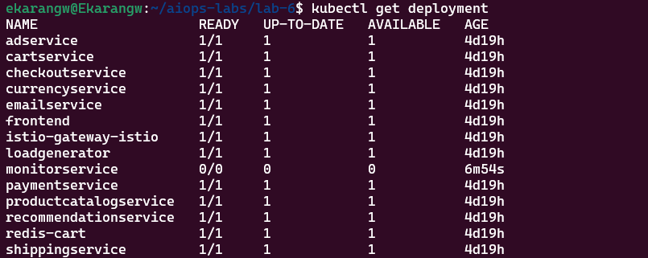
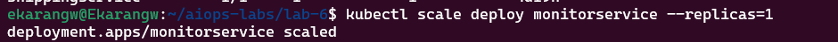
4.  console output as the monitor `kubectl logs <pod_id>`
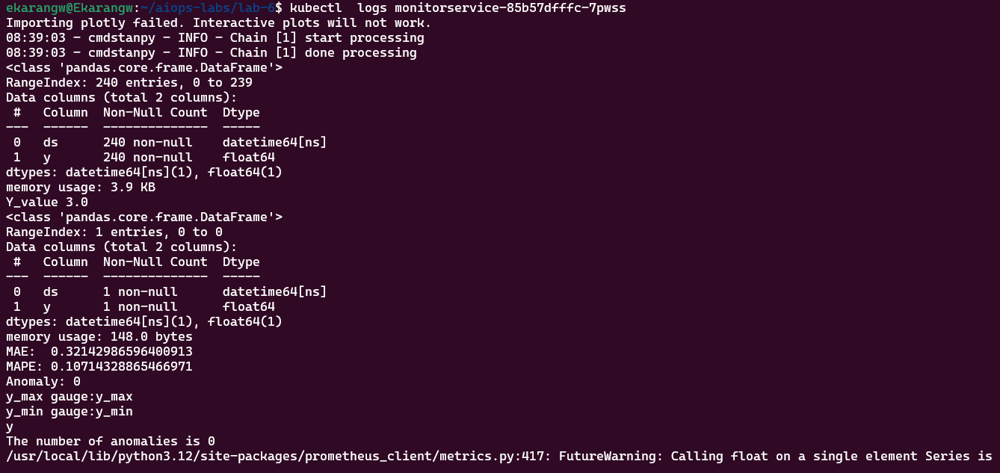
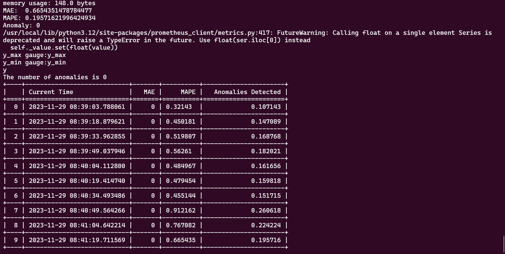

5. 

6. 

7. publish  anomaly metric and prediction quality metrics back to Grafana the monitor deployment
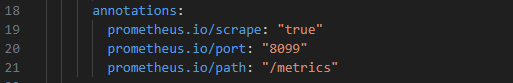
8.

