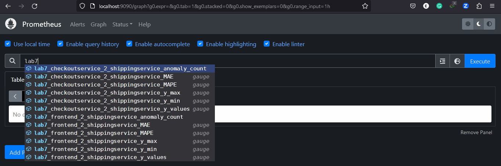
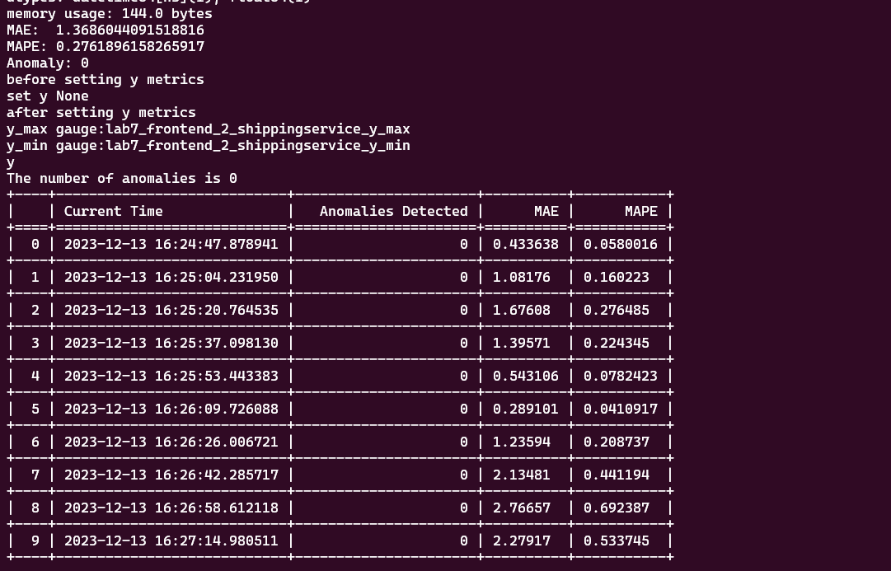
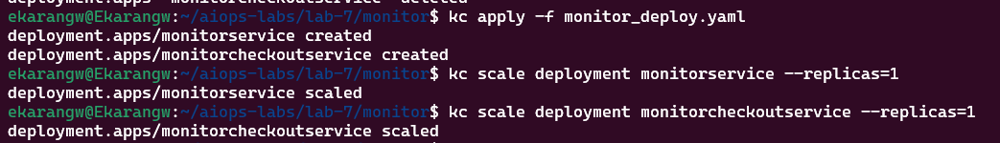
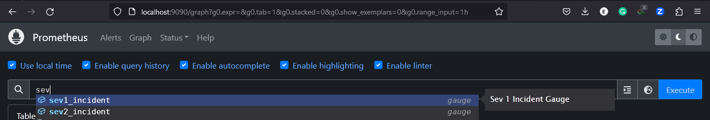
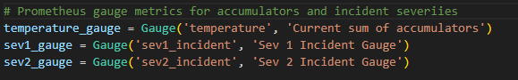
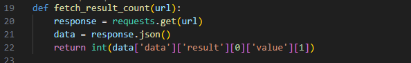
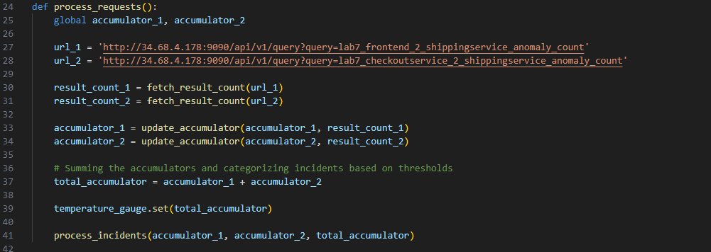
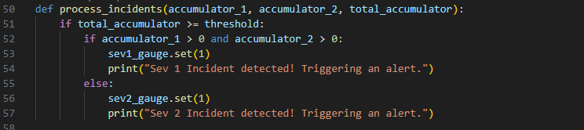
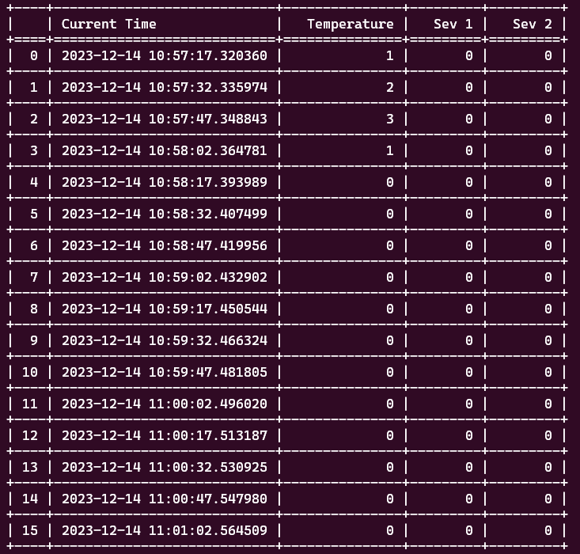

# LAB7

### Lab Task 1 – Generalize your Lab 6 monitor to track any service by K8S deployment configuration using the same docker image

### Lab Task 2 – Train and deploy anomaly monitors for 2 selected services

### Lab Task 3 – Implement an Incident detection monitor consuming 2 anomaly metrics
1. Metrics

2. Explanation of how you extended or refined the flowchart logic and why.

- Here, I declared and initialized the variables for the shreshord, accumulator one and two to zero.

- This function fetches the data values for both frontend and checkoutservice to shippingservice using prometheus query.

- This function Calculates Total Accumulator by summing both individual accumulators

- Check Threshold: Compared the total accumulator with the predefined threshold. Its because we need which service where the incident has occured. When the Accumulator 1 and accumulator 2 both are greater than 0, Severe Incicents 1 is detected otherwise Severe Incident 2 is detected.

3. Console log of running incident detector with custom load but no Istio faults

### Lab Task 4 – Detect Istio-generated raw anomalies and triggered incidents
1. Istio delay injection YAML spec’s

2. Console log showing detected anomalies 

### Lab Task 5 – Generate transient anomalies and show them tolerated by incident detector
1. Console logs showing transient generation and associated anomaly and incident detection.

2. Locustfile source showing the transient profile you have chosen and implemented.

3. Explanation of how you configured the transients and why

### Lab Task 6 – Design Grafana dashboard for raw request times, anomalies, and incidents
1. Screen shot of your designed and implemented Grafana dashboard.

### Lab Task 7 – Remove Visa Card billing method from your account
